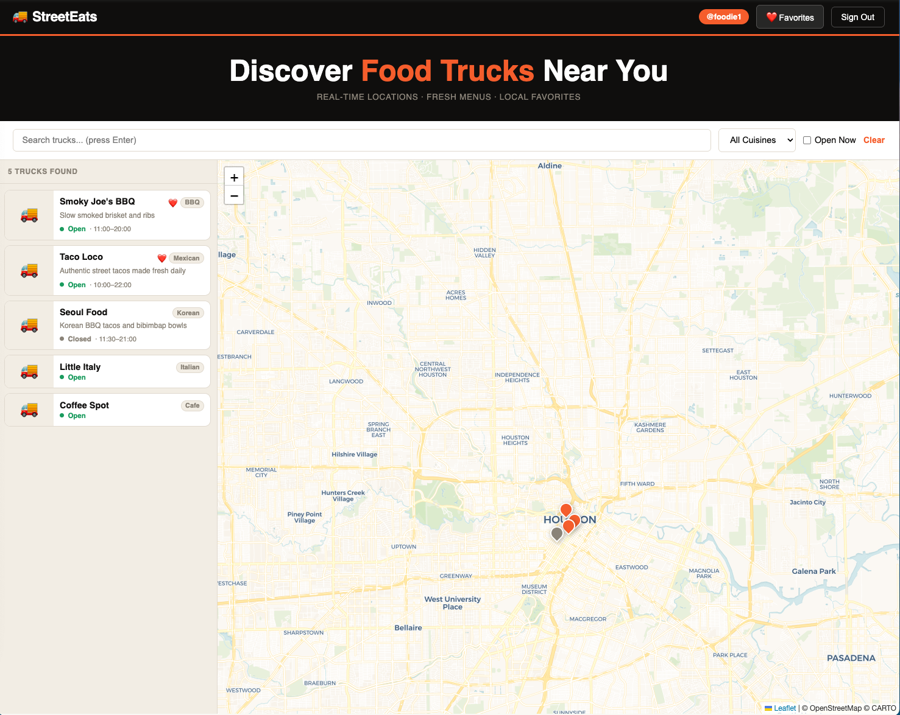
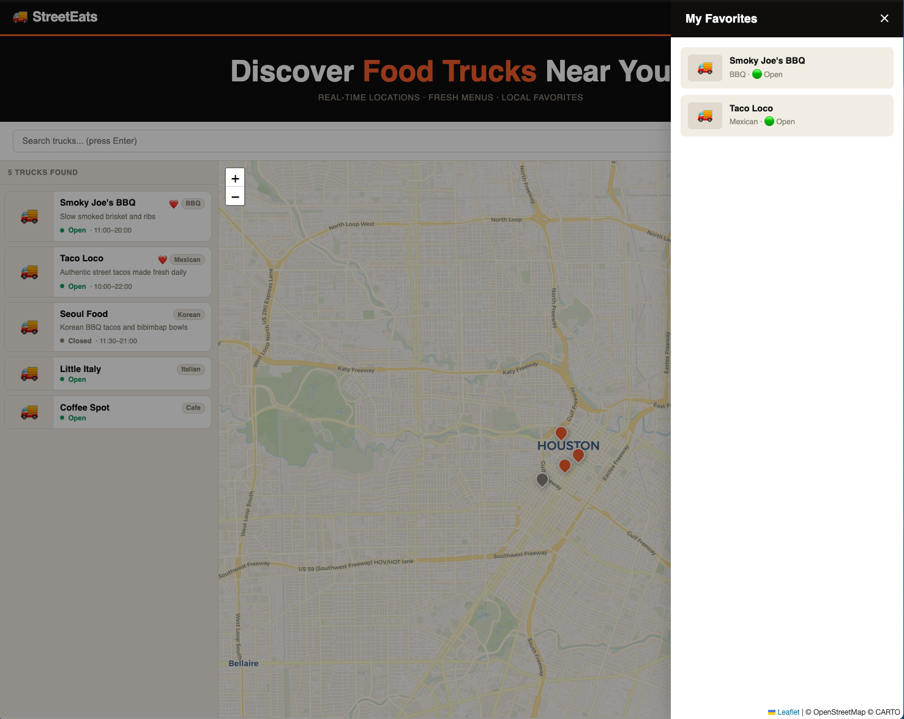
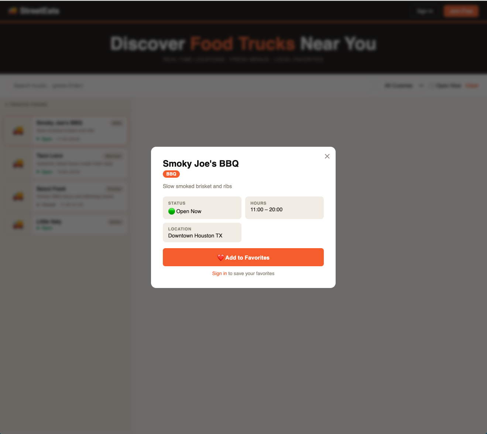
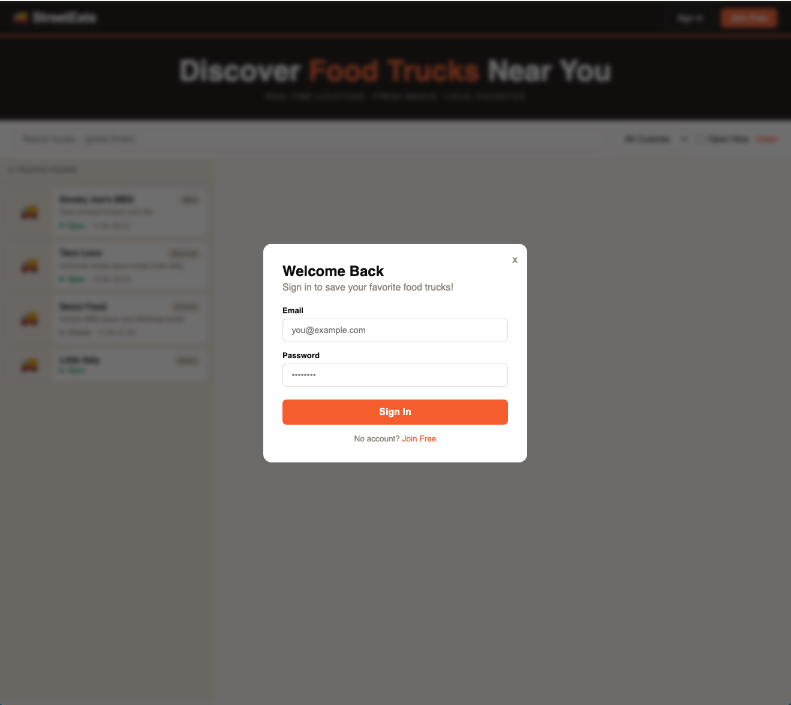
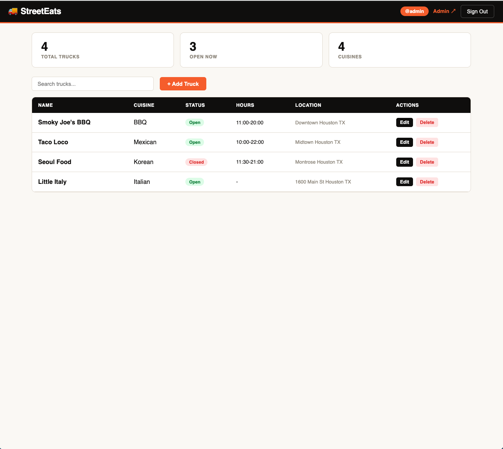
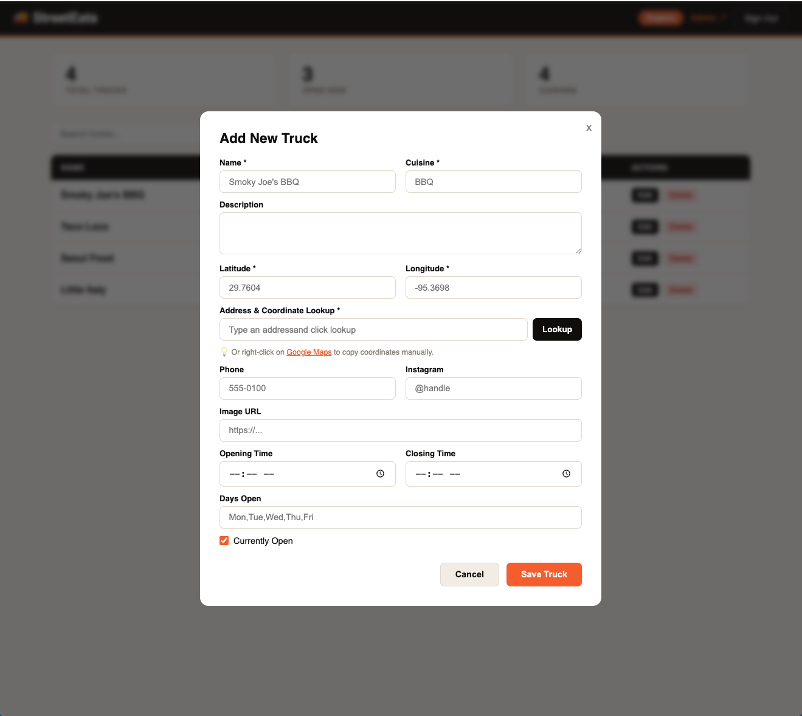
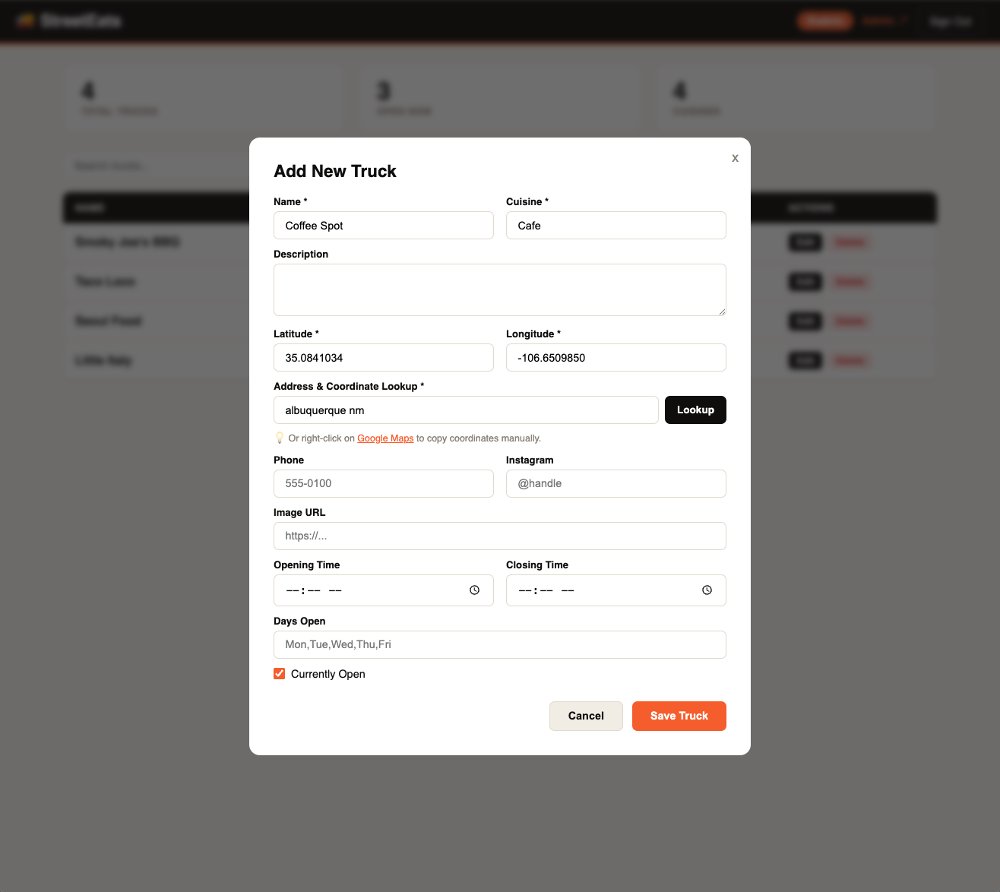
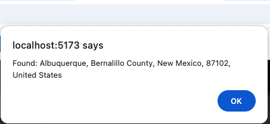
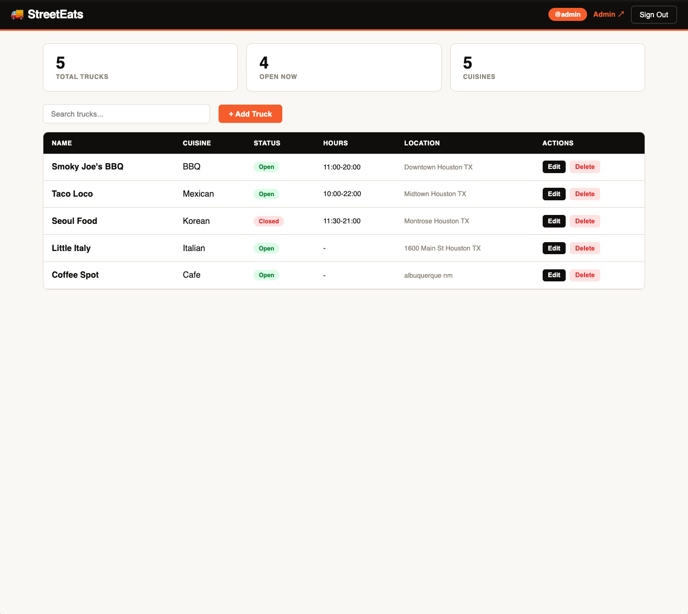

# 🚚 StreetEats

A full-stack food truck discovery platform where users can find local food trucks, view them on an interactive map, and save their favorites.

**Live Demo:** (add this once deployed)

---

## 📸 Screenshots












---

## ✨ Features

- 🗺️ Interactive map with real-time food truck markers
- 🔍 Search and filter by cuisine, name, and open/closed status
- 🔐 User authentication with JWT tokens
- ❤️ Save and manage favorite trucks
- 🛠️ Admin dashboard to add, edit, and delete trucks
- 📍 Address to coordinate lookup using OpenStreetMap

---

## 🏗️ Tech Stack

**Backend**
- Python + FastAPI
- SQLAlchemy ORM + SQLite
- JWT authentication with python-jose
- bcrypt password hashing

**Frontend**
- React 18 + Vite
- React Router v6
- Leaflet.js for maps
- Axios for API calls

---

## 🚀 Getting Started

### Prerequisites
- Python 3.11+
- Node.js 18+

### Backend Setup
```bash
# Clone the repo
git clone https://github.com/YOUR_USERNAME/streeteats.git
cd streeteats

# Create and activate virtual environment
python -m venv venv
source venv/bin/activate  # Windows: venv\Scripts\activate

# Install dependencies
pip install -r requirements.txt

# Set up environment variables
cp .env.example .env

# Seed the database
python scripts/seed.py

# Start the backend
python -m uvicorn main:app --reload
```

Backend runs at **http://localhost:8000**
API docs at **http://localhost:8000/docs**

### Frontend Setup
```bash
cd frontend
npm install
npm run dev
```

Frontend runs at **http://localhost:5173**

---

## 🔑 Default Admin Credentials

| Email | Password |
|-------|----------|
| admin@streeteats.com | admin123 |

> ⚠️ Change these before any public deployment

---

## 📡 API Endpoints

| Method | Endpoint | Auth | Description |
|--------|----------|------|-------------|
| POST | `/api/auth/register` | — | Register new user |
| POST | `/api/auth/login` | — | Login and get JWT |
| GET | `/api/auth/me` | 🔒 | Get current user |
| GET | `/api/trucks` | Optional | List and filter trucks |
| POST | `/api/trucks` | 🔒 Admin | Create truck |
| PUT | `/api/trucks/{id}` | 🔒 Admin | Update truck |
| DELETE | `/api/trucks/{id}` | 🔒 Admin | Delete truck |
| GET | `/api/favorites` | 🔒 | Get my favorites |
| POST | `/api/favorites/{id}` | 🔒 | Add favorite |
| DELETE | `/api/favorites/{id}` | 🔒 | Remove favorite |

---

## 🗂️ Project Structure
```
streeteats/
├── backend/
│   ├── core/
│   │   ├── config.py         # Settings
│   │   ├── database.py       # SQLAlchemy setup
│   │   ├── security.py       # JWT + bcrypt
│   │   └── dependencies.py   # Auth guards
│   ├── models/
│   │   └── models.py         # Database models
│   ├── routers/
│   │   ├── auth.py           # Auth routes
│   │   ├── trucks.py         # Truck routes
│   │   └── favorites.py      # Favorites routes
│   └── schemas/
│       └── schemas.py        # Pydantic schemas
├── frontend/
│   └── src/
│       ├── components/       # Reusable UI components
│       ├── context/          # Global auth state
│       ├── pages/            # Page components
│       └── services/         # API service layer
├── scripts/
│   └── seed.py               # Database seeder
├── main.py                   # FastAPI entry point
└── requirements.txt
```

---

## 🔮 Future Improvements

- [ ] Deploy to Railway or Render
- [ ] Switch SQLite to PostgreSQL for production
- [ ] Add truck images with file upload
- [ ] Reviews and ratings system
- [ ] Real-time open/closed based on current time
- [ ] Mobile responsive design

---

## 📄 License

Apache2
